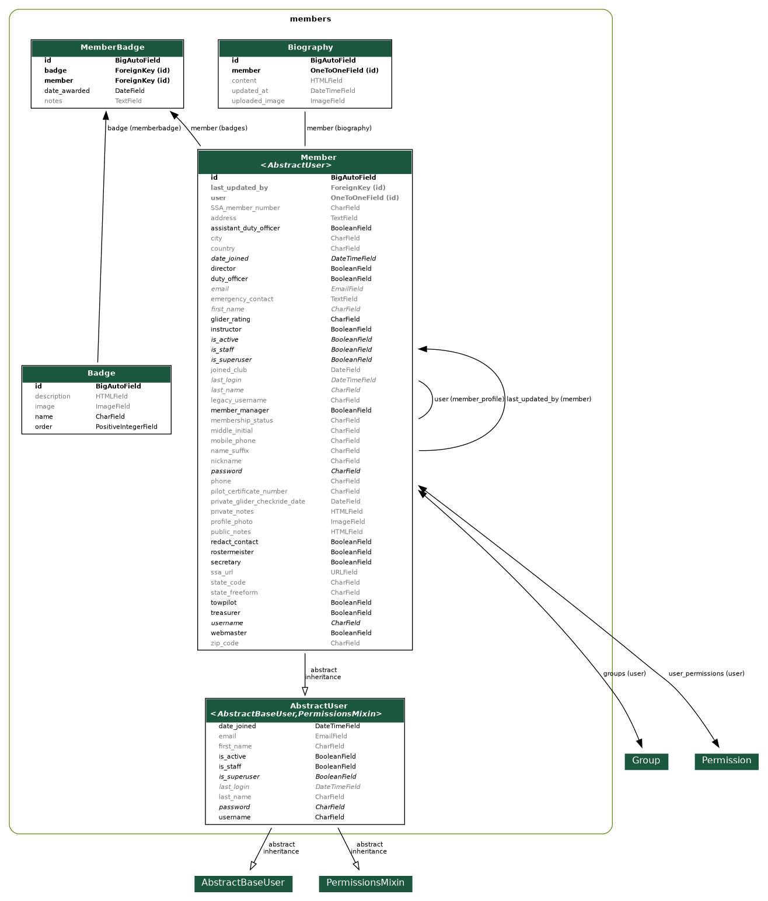

# Members App Models

This document describes the models in the `members` app and their relationships. See the ERD diagram below for a visual overview.

## Entity Relationship Diagram (ERD)

## Models

### `Biography`
- Stores member biographies, including rich text and upload path logic.
- Linked to `Member` via a foreign key.

### `Member`
- Extends Django's `AbstractUser`.
- Stores all member profile data, authentication info, and group/role logic.
- Methods for profile image, display name, group syncing, and status.

See also: [Redaction of Personal Contact Information](redaction.md)

### `Badge`
- Represents a badge that can be earned by a member.
- Includes badge name, description, and image.

### `MemberBadge`
- Through model linking `Member` and `Badge`.
- Tracks which badges a member has earned and when.

## Also See
- [README.md](README.md)
- [decorators.md](decorators.md)
- [pipeline.md](pipeline.md)
- [views.md](views.md)
- [management.md](management.md)
- [tests.md](tests.md)
- [forms.md](forms.md)
