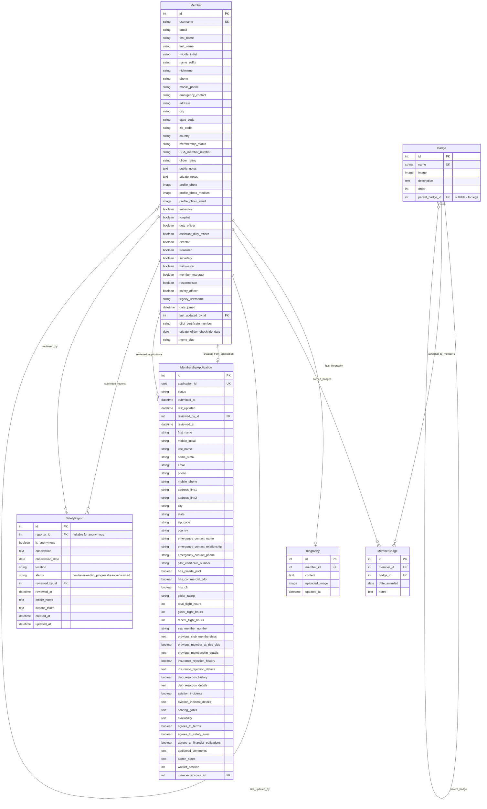

# Members App Models

This document describes the models in the `members` app and their relationships. See the database schema below for a visual overview.

## Database Schema

## Models

### `Member`
- Extends Django's `AbstractUser`.
- Stores all member profile data, authentication info, and group/role logic.
- Methods for profile image, display name, group syncing, and status.
- Includes `home_club` field for visiting pilots from other soaring clubs.
- Can be linked to a `MembershipApplication` that created the account.
- **Performance Optimization (Issue #285)**: Added database indexes on `membership_status` and `(last_name, first_name)` for faster filtering and sorting in logsheet operations.
- **Photo Thumbnails (Issue #286)**: Added `profile_photo_medium` (200x200) and `profile_photo_small` (64x64) fields for optimized page loading. Thumbnails are auto-generated when photos are uploaded via admin. URL properties (`profile_image_url_medium`, `profile_image_url_small`) provide graceful fallback chains.

See also: [Redaction of Personal Contact Information](redaction.md)

### `MembershipApplication`
- Stores membership applications from non-logged-in users (Issue #245).
- Comprehensive application form with personal info, aviation experience, and club history.
- Status tracking: pending, under review, waitlisted, approved, rejected, withdrawn.
- Links to `Member` account upon approval via `member_account` field.
- Includes waitlist management with position tracking.
- Administrative notes and review tracking for membership managers.

### `Biography`
- Stores member biographies, including rich text and upload path logic.
- Linked to `Member` via a foreign key.

### `Badge`
- Represents a badge that can be earned by a member.
- Includes badge name, description, and image.
- **Leg Support (Issue #560)**: Optional `parent_badge` FK allows badges to be designated as "legs" of a parent badge.
  - Example: "Silver Duration" is a leg of "FAI Silver Badge"
  - On the badge board, legs are suppressed for members who have already earned the parent badge.
  - This prevents showing redundant leg achievements when the full badge has been earned.

### `MemberBadge`
- Through model linking `Member` and `Badge`.
- Tracks which badges a member has earned and when.

### `SafetyReport`
- Stores safety observations, suggestions, and near-miss reports from members.
- Supports fully anonymous submissions: when `is_anonymous=True`, the `reporter` field is intentionally left null to honor anonymity.
- Reports go through a status workflow: new → reviewed → in_progress → resolved → closed.
- Safety officers (members with `safety_officer=True`) can review reports, add notes, and track actions taken.
- Linked to `Member` via optional `reporter` FK (null for anonymous) and `reviewed_by` FK.
- Uses TinyMCE HTMLField for rich text observations and officer notes.

## Also See
- [README.md](README.md)
- [decorators.md](decorators.md)
- [pipeline.md](pipeline.md)
- [views.md](views.md)
- [management.md](management.md)
- [tests.md](tests.md)
- [forms.md](forms.md)
