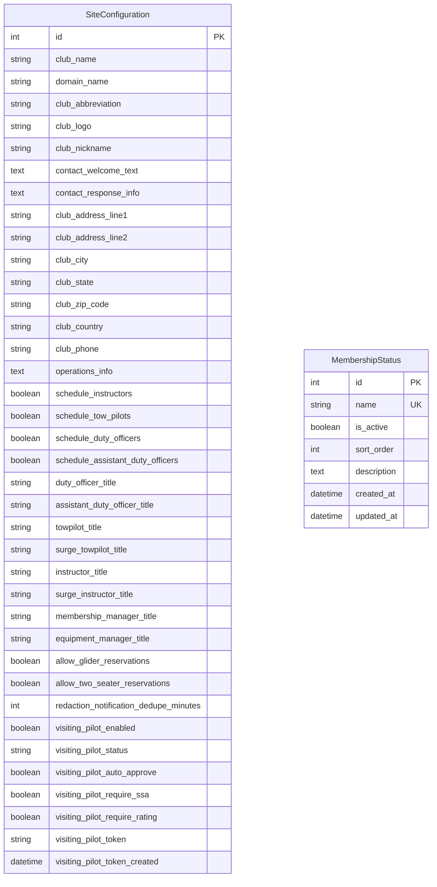

# Models in siteconfig/models.py

This document describes all models in `siteconfig/models.py` and includes the database schema for this app.

---

## Database Schema



## SiteConfiguration
- **Purpose:** Stores site-wide configuration settings for multi-club support, including branding, contact information, operational preferences, and visiting pilot workflow.
- **Key Features:** Singleton model (only one instance allowed), complete contact form customization, configurable role titles, scheduling toggles, club address/location management, visiting pilot security token lifecycle
- **Contact Fields:** `contact_welcome_text`, `contact_response_info`, complete address fields, `club_phone`, `operations_info`
- **Role Titles:** All staff positions configurable (Duty Officer, Instructor, Tow Pilot, etc.)
- **Operational Settings:** Scheduling preferences, reservation controls, notification settings
- **Visiting Pilot Features:** Complete workflow configuration, security token management, auto-approval settings, validation requirements
- **Usage:** Accessed via template tags and admin interface, enables multi-club deployment with club-specific branding and contact handling

## MembershipStatus
- **Purpose:** Configurable membership statuses that replace hardcoded membership types (Issue #169).
- **Key Features:** Dynamic membership statuses, active/inactive control, custom sort ordering, deletion protection
- **Fields:** name (unique), is_active, sort_order, description, timestamps
- **Usage:** Referenced by Member model, managed via Django admin, provides flexible membership classification

---

## Model Relationships

### SiteConfiguration
- **Standalone model**: No foreign key relationships, acts as a global configuration singleton
- **CMS Integration**: Contact fields power the visitor contact form (`/contact/`) for multi-club deployment
- **Template integration**: Accessed via `` template tag and direct context in CMS views
- **Admin interface**: Single object editing interface with collapsible fieldsets for contact and scheduling options

### MembershipStatus  
- **Referenced by Member model**: `Member.membership_status` field uses dynamic choices from this model
- **Logical relationship**: Connected to members through string field matching, not foreign key
- **Migration support**: Automatically populated from previous hardcoded values during upgrade

---

## Key Methods

### SiteConfiguration
- `clean()`: Enforces singleton pattern by preventing multiple instances
- Template tag integration for accessing configuration in templates

### MembershipStatus
- `get_active_statuses()`: Class method returning all active membership statuses
- `get_membership_choices()`: Class method providing dynamic choices for Member model
- `__str__()`: Returns the status name for admin display

---

## Usage Examples

### SiteConfiguration
```python
from siteconfig.models import SiteConfiguration

# Get the singleton configuration
config = SiteConfiguration.objects.first()
print(config.club_name)
print(config.membership_manager_title)

# Access contact form configuration
print(config.contact_welcome_text)
print(config.club_address_line1)
print(config.club_phone)

# Check operational settings
if config.schedule_instructors:
    print("This club schedules instructors ahead of time")

# Access customizable role titles
print(f"Duty officers are called: {config.duty_officer_title}")
print(f"Instructors are called: {config.instructor_title}")
```

### MembershipStatus
```python
from siteconfig.models import MembershipStatus

# Get all active statuses
active_statuses = MembershipStatus.get_active_statuses()

# Create a new status
MembershipStatus.objects.create(
    name="Trial Member",
    is_active=True,
    sort_order=15
)
```

---

## Integration Notes

### Issue #70 - Visitor Contact System
The contact-related fields in `SiteConfiguration` (added in migration 0008) power the visitor contact form system:
- `contact_welcome_text` and `contact_response_info` provide customizable messaging
- Address fields enable Google Maps integration and location display
- `club_phone` and `operations_info` offer additional contact methods
- All fields support multi-club deployment by making previously hardcoded content configurable

The CMS contact form (`/contact/`) automatically uses these fields via template context, eliminating the need for hardcoded club-specific information.

### Issue #209 - Visiting Pilot Workflow
The visiting pilot fields in `SiteConfiguration` (added in migrations 0010-0012) power the complete visiting pilot workflow system:

**Configuration Fields:**
- `visiting_pilot_enabled`: Master toggle for the entire visiting pilot feature
- `visiting_pilot_status`: Membership status assigned to visiting pilots (typically "Affiliate Member")
- `visiting_pilot_auto_approve`: Whether to auto-approve visiting pilots or require manual review
- `visiting_pilot_require_ssa`: Require SSA membership during signup
- `visiting_pilot_require_rating`: Require pilot rating during signup

**Security Token Management:**
- `visiting_pilot_token`: Daily security token for QR code access (12-character random string)
- `visiting_pilot_token_created`: Datetime the current token was generated

**Key Methods:**
- `get_or_create_daily_token()`: Generates new token if needed, returns current token
- `retire_visiting_pilot_token()`: Clears token and date (called on logsheet finalization)

The system provides a secure, streamlined workflow for visiting pilots to register and participate in operations. Security tokens prevent bot abuse while maintaining ease of use. Integration with logsheet management and flight forms provides seamless operational workflow.

---

## Also See
- [README (App Overview)](README.md)
- [Membership Status Management](membership-statuses.md)
- [Template Tags Documentation](../templatetags/)
- [CMS Models Documentation](../../cms/docs/models.md) - VisitorContact integration
