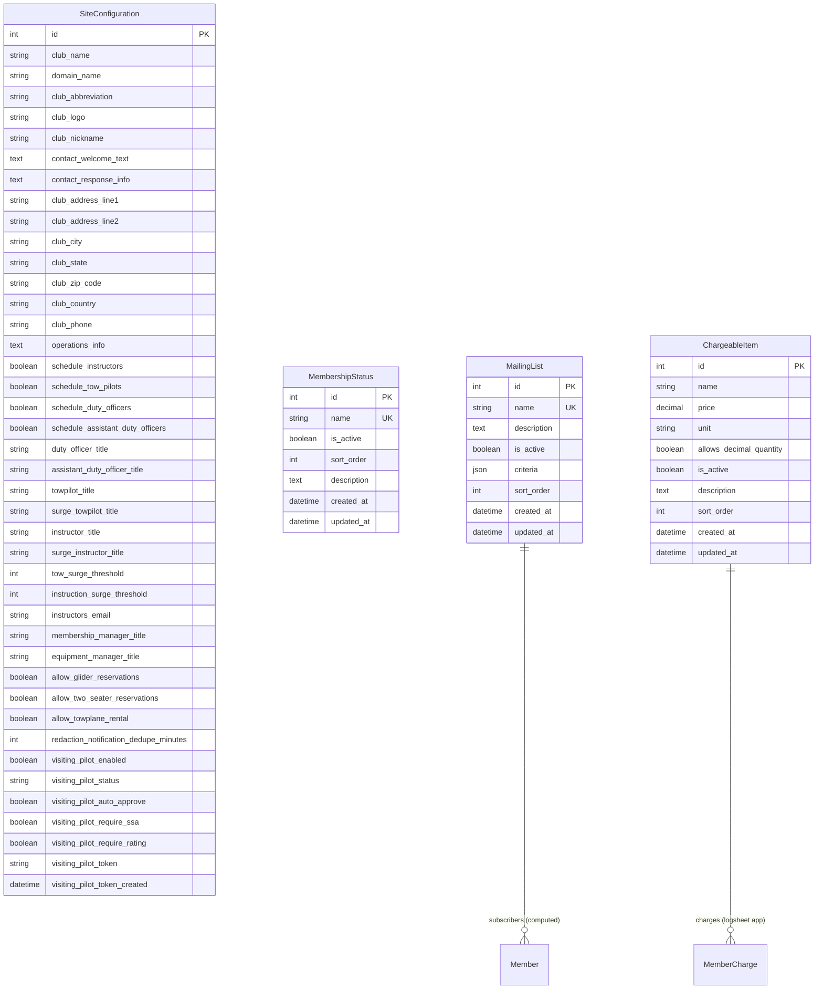

# Models in siteconfig/models.py

This document describes all models in `siteconfig/models.py` and includes the database schema for this app.

---

## Database Schema



## SiteConfiguration
- **Purpose:** Stores site-wide configuration settings for multi-club support, including branding, contact information, operational preferences, and visiting pilot workflow.
- **Key Features:** Singleton model (only one instance allowed), complete contact form customization, configurable role titles, scheduling toggles, club address/location management, visiting pilot security token lifecycle, surge threshold configuration
- **Contact Fields:** `contact_welcome_text`, `contact_response_info`, complete address fields, `club_phone`, `operations_info`
- **Role Titles:** All staff positions configurable (Duty Officer, Instructor, Tow Pilot, etc.)
- **Operational Settings:** Scheduling preferences, reservation controls, towplane rental permissions, notification settings
- **Surge Thresholds:** Configurable thresholds for tow and instruction demand alerts (Issue #403). Both thresholds trigger AT or ABOVE the specified value (e.g., threshold=4 triggers at 4+ requests). This ensures consistent behavior across both threshold types.
- **Instructor Surge Email:** `instructors_email` is notified when a duty instructor accepts 3 or more students on a single day (Issue #646). This is a separate mechanism from the ops-intent surge thresholds in terms of its trigger source — it fires from `InstructionSlot` acceptances, not ops-intent sign-up counts — but both paths share the same `DutyAssignment.surge_notified` suppression flag, so only the first mechanism to fire will send an email for a given assignment date.
- **Visiting Pilot Features:** Complete workflow configuration, security token management, auto-approval settings, validation requirements
- **Usage:** Accessed via template tags and admin interface, enables multi-club deployment with club-specific branding and contact handling

## MembershipStatus
- **Purpose:** Configurable membership statuses that replace hardcoded membership types (Issue #169).
- **Key Features:** Dynamic membership statuses, active/inactive control, custom sort ordering, deletion protection
- **Fields:** name (unique), is_active, sort_order, description, timestamps
- **Usage:** Referenced by Member model, managed via Django admin, provides flexible membership classification

## MailingList
- **Purpose:** Configurable mailing list definitions for the club email system (Issue #353).
- **Key Features:** Flexible subscriber criteria using OR logic, admin interface with checkbox selection, JSON criteria storage
- **Fields:** name (unique), description, is_active, criteria (JSONField), sort_order, timestamps
- **Usage:** Powers the email_lists API for external mail systems (Google Groups, Mailman, etc.)

### MailingListCriterion
- **Purpose:** TextChoices enum defining available criteria for mailing list membership.
- **Available Criteria:**
  - `active_member` - Active club members with valid email
  - `instructor` - Active instructors
  - `towpilot` - Active tow pilots
  - `duty_officer` - Active duty officers
  - `assistant_duty_officer` - Active assistant duty officers
  - `director` - Board directors
  - `secretary` - Club secretary
  - `treasurer` - Club treasurer
  - `webmaster` - Club webmaster
  - `member_manager` - Membership managers
  - `rostermeister` - Roster managers
  - `private_glider_owner` - Owners of active private (non-club) gliders

## ChargeableItem
- **Purpose:** Catalog of purchasable items and service charges for miscellaneous member billing (Issue #66, #413).
- **Key Features:** Supports per-item and per-hour pricing, active/inactive toggle, decimal quantity control, sortable display order.
- **Fields:** name, price, unit (each/hour), allows_decimal_quantity, is_active, description, sort_order, timestamps
- **Cross-App Usage:** Referenced by `MemberCharge` model in logsheet app. Duty officers select from active ChargeableItems when adding charges during logsheet management (Issue #615).
- **Admin Interface:** Managed by webmaster via Django admin (`ChargeableItemAdmin`)
- **Examples:** T-shirts, logbooks, aerotow retrieves, instruction materials

---

## Model Relationships

### SiteConfiguration
- **Standalone model**: No foreign key relationships, acts as a global configuration singleton
- **CMS Integration**: Contact fields power the visitor contact form (`/contact/`) for multi-club deployment
- **Template integration**: Accessed via `` template tag and direct context in CMS views
- **Admin interface**: Single object editing interface with collapsible fieldsets for contact and scheduling options

### MembershipStatus  
- **Referenced by Member model**: `Member.membership_status` field uses dynamic choices from this model
- **Logical relationship**: Connected to members through string field matching, not foreign key
- **Migration support**: Automatically populated from previous hardcoded values during upgrade

### MailingList
- **Computed relationship with Member**: `get_subscribers()` dynamically queries members matching criteria
- **API integration**: Powers `email_lists` API endpoint in `members/api.py`
- **Criteria logic**: Uses OR logic - members matching ANY selected criterion are included
- **Active member filtering**: All criteria automatically filter for active membership status and valid email

---

## Key Methods

### SiteConfiguration
- `clean()`: Enforces singleton pattern by preventing multiple instances
- Template tag integration for accessing configuration in templates

### MembershipStatus
- `get_active_statuses()`: Class method returning all active membership statuses
- `get_membership_choices()`: Class method providing dynamic choices for Member model
- `__str__()`: Returns the status name for admin display

### MailingList
- `clean()`: Validates that criteria contains at least one valid criterion code
- `get_criteria_display()`: Returns human-readable list of selected criteria
- `get_subscribers()`: Returns queryset of Member objects matching criteria (OR logic)
- `_criterion_to_query()`: Converts criterion code to Django Q object with base active filter
- `get_subscriber_emails()`: Returns list of email addresses for all subscribers
- `get_subscriber_count()`: Returns count of subscribers to this list

---

## Usage Examples

### SiteConfiguration
```python
from siteconfig.models import SiteConfiguration

# Get the singleton configuration
config = SiteConfiguration.objects.first()
print(config.club_name)
print(config.membership_manager_title)

# Access contact form configuration
print(config.contact_welcome_text)
print(config.club_address_line1)
print(config.club_phone)

# Check operational settings
if config.schedule_instructors:
    print("This club schedules instructors ahead of time")

# Access customizable role titles
print(f"Duty officers are called: {config.duty_officer_title}")
print(f"Instructors are called: {config.instructor_title}")
```

### MembershipStatus
```python
from siteconfig.models import MembershipStatus

# Get all active statuses
active_statuses = MembershipStatus.get_active_statuses()

# Create a new status
MembershipStatus.objects.create(
    name="Trial Member",
    is_active=True,
    sort_order=15
)
```

### MailingList
```python
from siteconfig.models import MailingList, MailingListCriterion

# Create a mailing list for instructors
instructors_list = MailingList.objects.create(
    name="instructors",
    description="All active club instructors",
    criteria=[MailingListCriterion.INSTRUCTOR]
)

# Create a board mailing list with multiple criteria (OR logic)
board_list = MailingList.objects.create(
    name="board",
    description="Board of directors and officers",
    criteria=[
        MailingListCriterion.DIRECTOR,
        MailingListCriterion.SECRETARY,
        MailingListCriterion.TREASURER
    ]
)

# Get subscriber count and emails
print(f"Board list has {board_list.get_subscriber_count()} members")
emails = board_list.get_subscriber_emails()

# Get full subscriber queryset for more processing
subscribers = board_list.get_subscribers()
for member in subscribers:
    print(f"{member.first_name} {member.last_name}: {member.email}")

# Display human-readable criteria
print(board_list.get_criteria_display())  # ['Director', 'Secretary', 'Treasurer']
```

---

## Integration Notes

### Issue #70 - Visitor Contact System
The contact-related fields in `SiteConfiguration` (added in migration 0008) power the visitor contact form system:
- `contact_welcome_text` and `contact_response_info` provide customizable messaging
- Address fields enable Google Maps integration and location display
- `club_phone` and `operations_info` offer additional contact methods
- All fields support multi-club deployment by making previously hardcoded content configurable

The CMS contact form (`/contact/`) automatically uses these fields via template context, eliminating the need for hardcoded club-specific information.

### Issue #209 - Visiting Pilot Workflow
The visiting pilot fields in `SiteConfiguration` (added in migrations 0010-0012) power the complete visiting pilot workflow system:

**Configuration Fields:**
- `visiting_pilot_enabled`: Master toggle for the entire visiting pilot feature
- `visiting_pilot_status`: Membership status assigned to visiting pilots (typically "Affiliate Member")
- `visiting_pilot_auto_approve`: Whether to auto-approve visiting pilots or require manual review
- `visiting_pilot_require_ssa`: Require SSA membership during signup
- `visiting_pilot_require_rating`: Require pilot rating during signup

**Security Token Management:**
- `visiting_pilot_token`: Daily security token for QR code access (12-character random string)
- `visiting_pilot_token_created`: Datetime the current token was generated

**Key Methods:**
- `get_or_create_daily_token()`: Generates new token if needed, returns current token
- `retire_visiting_pilot_token()`: Clears token and date (called on logsheet finalization)

The system provides a secure, streamlined workflow for visiting pilots to register and participate in operations. Security tokens prevent bot abuse while maintaining ease of use. Integration with logsheet management and flight forms provides seamless operational workflow.

### Issue #123 - Towplane Rental Configuration
The `allow_towplane_rental` field in `SiteConfiguration` (added in migration 0015) provides clubs with control over towplane rental functionality:

**Configuration Field:**
- `allow_towplane_rental`: Boolean field that enables/disables towplane rental features across the system

**Default Behavior:**
- Defaults to `False` (disabled) to respect conservative club policies
- When disabled, rental fields are completely hidden from forms and reports
- When enabled, full towplane rental functionality becomes available

**Integration Points:**
- **Forms**: `TowplaneCloseoutForm` conditionally shows rental fields based on this setting
- **Templates**: Rental sections in closeout and financial management templates are conditionally rendered
- **Views**: Financial management view passes rental status to templates via context

**Usage:**
```python
# Check if towplane rentals are enabled
config = SiteConfiguration.objects.first()
if config and config.allow_towplane_rental:
    # Show rental functionality
    pass
```

This feature allows clubs to opt-in to towplane rental functionality for non-towing purposes (sightseeing flights, flight reviews, aircraft retrieval) while maintaining a clean interface for clubs that don't allow such usage.

### Issue #353 - Mailing List Management
The `MailingList` model (added in migration 0018) provides configurable mailing list definitions for external email systems:

**Model Design:**
- `MailingList`: Stores list name, description, active status, and criteria
- `MailingListCriterion`: TextChoices enum with 12 available criteria types
- `criteria`: JSONField storing list of criterion codes

**Subscriber Selection Logic:**
- Uses OR logic: members matching ANY selected criterion are included
- All criteria automatically filter for active membership status
- Excludes members with empty or null email addresses
- Defensive `is_active=True` filter handles edge cases

**Available Criteria:**
- Role-based: instructor, towpilot, duty_officer, assistant_duty_officer
- Board/management: director, secretary, treasurer, webmaster, member_manager, rostermeister
- Special: active_member (base criterion), private_glider_owner

**Admin Interface:**
- Checkbox-based criteria selection using `MultipleChoiceField`
- Permissions restricted to webmasters (user must have `webmaster=True`)
- Real-time subscriber count display in admin list view

**API Integration:**
The `email_lists` API endpoint (`members/api.py`) dynamically generates mailing lists from the database:

```python
# API response format
{
    "lists": {
        "instructors": {
            "description": "All active club instructors",
            "count": 12,
            "emails": ["instructor1@example.com", ...]
        },
        ...
    }
}
```

**Usage:**
```python
from siteconfig.models import MailingList

# Get all active mailing lists
for ml in MailingList.objects.filter(is_active=True):
    print(f"{ml.name}: {ml.get_subscriber_count()} subscribers")
```

This feature replaces hardcoded mailing list definitions with configurable database-driven lists, enabling clubs to customize their email distribution without code changes.

---

## Also See
- [README (App Overview)](README.md)
- [Membership Status Management](membership-statuses.md)
- [Template Tags Documentation](../templatetags/)
- [CMS Models Documentation](../../cms/docs/models.md) - VisitorContact integration
