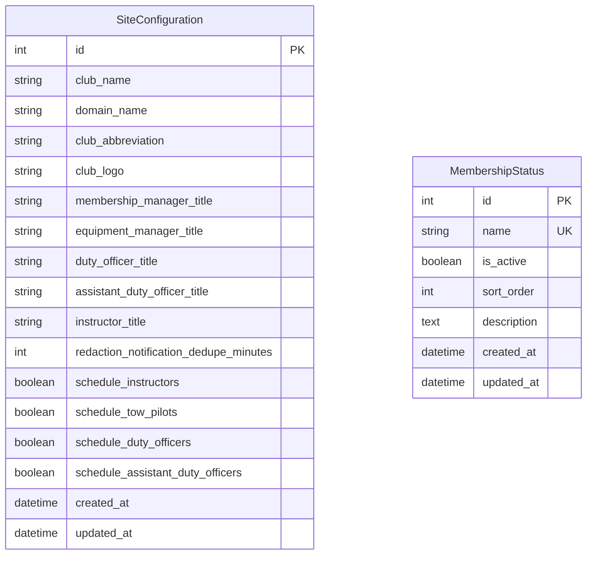

# Models in siteconfig/models.py

This document describes all models in `siteconfig/models.py` and includes the database schema for this app.

---

## Database Schema



## SiteConfiguration
- **Purpose:** Stores site-wide configuration settings and customizable role titles for the club.
- **Key Features:** Singleton model (only one instance allowed), configurable role titles, scheduling toggles
- **Fields:** club_name, domain_name, club_abbreviation, club_logo, various role titles, scheduling settings
- **Usage:** Accessed via template tags and admin interface, controls site-wide behavior and branding

## MembershipStatus
- **Purpose:** Configurable membership statuses that replace hardcoded membership types (Issue #169).
- **Key Features:** Dynamic membership statuses, active/inactive control, custom sort ordering, deletion protection
- **Fields:** name (unique), is_active, sort_order, description, timestamps
- **Usage:** Referenced by Member model, managed via Django admin, provides flexible membership classification

---

## Model Relationships

### SiteConfiguration
- **Standalone model**: No foreign key relationships, acts as a global configuration singleton
- **Template integration**: Accessed via `` template tag
- **Admin interface**: Single object editing interface

### MembershipStatus  
- **Referenced by Member model**: `Member.membership_status` field uses dynamic choices from this model
- **Logical relationship**: Connected to members through string field matching, not foreign key
- **Migration support**: Automatically populated from previous hardcoded values during upgrade

---

## Key Methods

### SiteConfiguration
- `clean()`: Enforces singleton pattern by preventing multiple instances
- Template tag integration for accessing configuration in templates

### MembershipStatus
- `get_active_statuses()`: Class method returning all active membership statuses
- `get_membership_choices()`: Class method providing dynamic choices for Member model
- `__str__()`: Returns the status name for admin display

---

## Usage Examples

### SiteConfiguration
```python
from siteconfig.models import SiteConfiguration

# Get the singleton configuration
config = SiteConfiguration.objects.first()
print(config.club_name)
print(config.membership_manager_title)
```

### MembershipStatus
```python
from siteconfig.models import MembershipStatus

# Get all active statuses
active_statuses = MembershipStatus.get_active_statuses()

# Create a new status
MembershipStatus.objects.create(
    name="Trial Member",
    is_active=True,
    sort_order=15
)
```

---

## Also See
- [README (App Overview)](README.md)
- [Membership Status Management](membership-statuses.md)
- [Template Tags Documentation](../templatetags/)