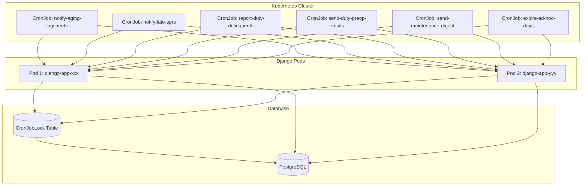

# Utils App Documentation

The `utils` app provides shared functionality and utilities used across the Manage2Soar project.

## Overview

The utils app contains:

- **Distributed Locking System**: PostgreSQL-based coordination for scheduled tasks
- **Management Commands**: Base classes and utilities for Django commands
- **Upload Utilities**: File upload helpers with entropy-based naming
- **Admin Helpers**: Shared functionality for Django admin interface
- **Test Infrastructure**: Testing utilities and fixtures

## Key Components

### CronJob System

The flagship feature is a sophisticated distributed CronJob system that coordinates scheduled tasks across multiple Kubernetes pods:

- **BaseCronJobCommand**: Abstract base class for all scheduled commands
- **CronJobLock Model**: Database-level locking mechanism
- **Production Commands**: Aging logsheets, late SPRs, duty delinquents
- **Kubernetes Integration**: CronJob manifests with proper resource limits

### File Upload Utilities

- **`upload_entropy.py`**: Entropy-based file naming for security
- **`upload_document_obfuscated.py`**: Document upload path obfuscation

### Admin Utilities

- **`admin_helpers.py`**: Shared Django admin functionality
- **`favicon.py`**: Favicon handling utilities

## Architecture

## Production Deployment

The CronJob system is deployed in production Kubernetes with:

- **6 Scheduled Jobs**: Running daily, weekly, and monthly
- **2 Pod Replicas**: High availability with distributed coordination  
- **PostgreSQL Locking**: Database-level synchronization
- **Resource Management**: CPU/memory limits and monitoring
- **Error Handling**: Graceful failures and automatic retries

## Documentation Structure

- **[models.md](models.md)**: Database models and schemas
- **[README_CronJobs.md](../README_CronJobs.md)**: CronJob system details
- **Test Coverage**: Comprehensive pytest suites

## Performance Metrics

Recent production performance:

- **Aging Logsheets**: 0.29s execution, found 1 aging logsheet
- **Late SPRs**: 1.33s execution, checked 34 instructional flights  
- **Duty Delinquents**: 5.52s execution, analyzed 75 members, found 19 delinquents

## Business Impact

The automated notification system has identified real operational issues:

- **Unfinalized Logsheets**: 11-day-old logsheet requiring attention
- **Duty Participation**: 19 actively flying members not performing duty
- **Training Oversight**: System ready to catch overdue Student Progress Reports

## Development

### Adding New Scheduled Commands

1. Inherit from `BaseCronJobCommand`
2. Define unique `job_name`
3. Implement `execute_job()` method
4. Add Kubernetes CronJob manifest
5. Include comprehensive tests

### Testing

- **Unit Tests**: `test_base_cronjob.py` - Core framework
- **Integration Tests**: `test_cronjob_integration.py` - End-to-end
- **Command Tests**: Individual command test suites

## Security

- **Pod Isolation**: Commands only release their own locks
- **Database Security**: Standard Django ORM permissions
- **Resource Limits**: Kubernetes resource constraints
- **Error Isolation**: Failed jobs don't affect other operations

## Monitoring

Monitor these production metrics:

- **Lock Contention**: Failed lock acquisitions
- **Execution Times**: Command performance trends
- **Error Rates**: Job failure frequency
- **Resource Usage**: CPU/memory consumption

## Also See

- [Main README](../../README.md) - Project overview
- [CronJob Architecture](../../docs/cronjob-architecture.md) - System design
- [Kubernetes Manifests](../../k8s-cronjobs.yaml) - Deployment config
