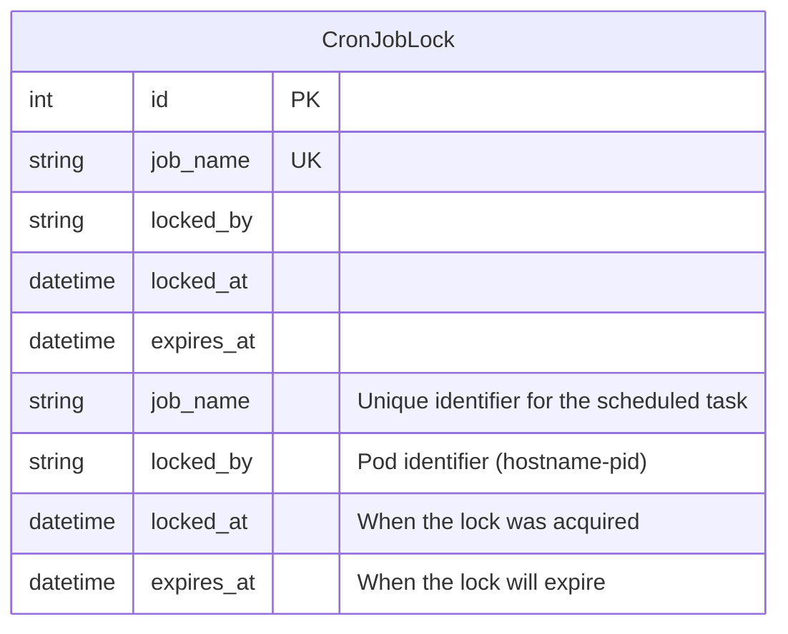

# Utils App Models

This document describes the models in the `utils` app and their relationships. The utils app provides shared functionality across the Manage2Soar project, including distributed locking for scheduled tasks.

## Database Schema



## Models

### `CronJobLock`

The `CronJobLock` model provides distributed locking functionality for scheduled management commands running in a Kubernetes environment with multiple pod replicas.

#### Fields

- **`job_name`** (CharField, max_length=100, unique=True)
  - Unique identifier for the scheduled task
  - Used as the primary key for lock coordination
  - Examples: "notify_aging_logsheets", "report_duty_delinquents"

- **`locked_by`** (CharField, max_length=100)
  - Identifier of the pod that acquired the lock
  - Format: `{hostname}-{pid}` (e.g., "django-app-c7895b487-46wjx-1234")
  - Used to identify which pod owns the lock for debugging

- **`locked_at`** (DateTimeField)
  - Timestamp when the lock was acquired
  - Used for debugging and monitoring lock duration

- **`expires_at`** (DateTimeField)
  - Timestamp when the lock will automatically expire
  - Prevents stale locks from blocking execution indefinitely
  - Default expiration is based on the command's `max_execution_time`

#### Methods

- **`is_expired()`** → bool
  - Returns True if the lock has passed its expiration time
  - Used by the locking system to determine if expired locks can be cleaned up

- **`cleanup_expired_locks()`** (class method) → int
  - Removes all expired locks from the database
  - Returns the number of locks that were cleaned up
  - Called automatically before attempting to acquire new locks

#### String Representation

Returns: `"{job_name} ({locked_by})"` 

Example: `"notify_aging_logsheets (django-app-c7895b487-46wjx-1234)"`

## Usage Patterns

### Distributed Locking Architecture

The `CronJobLock` model is the foundation of the distributed CronJob system that prevents race conditions when multiple Kubernetes pods attempt to execute the same scheduled task simultaneously.

#### Lock Acquisition Flow

1. **Cleanup Expired Locks**: Remove any stale locks that have passed their expiration time
2. **Attempt Lock Creation**: Try to create a new lock record with the job name
3. **Handle Conflicts**: If a lock already exists, check if it's expired
4. **Replace Expired Locks**: If expired, update the existing lock with new pod information
5. **Fail Gracefully**: If an active lock exists, skip execution and log the conflict

#### Lock Release Flow

1. **Normal Completion**: Delete the lock record when the job completes successfully
2. **Error Handling**: Ensure locks are released even if the job fails
3. **Pod-Specific Release**: Only allow the pod that created the lock to release it

### Integration with BaseCronJobCommand

The `CronJobLock` model is tightly integrated with the `BaseCronJobCommand` class:

```python
class MyScheduledCommand(BaseCronJobCommand):
    job_name = "my_unique_job"  # Maps to CronJobLock.job_name
    max_execution_time = timedelta(minutes=30)  # Sets expires_at
    
    def execute_job(self, *args, **options):
        # Your job logic here - protected by distributed lock
        pass
```

## Database Constraints

### Unique Constraints

- **`job_name`**: Ensures only one lock per scheduled task can exist
  - Prevents multiple pods from acquiring the same lock simultaneously
  - Database-level enforcement for maximum reliability

### Indexes

The unique constraint on `job_name` automatically creates an index for efficient lock lookups.

## Monitoring and Debugging

### Lock Status Queries

```python
# View all active locks
active_locks = CronJobLock.objects.all()

# Check specific job status
aging_lock = CronJobLock.objects.filter(job_name="notify_aging_logsheets").first()

# Find expired locks
expired_locks = CronJobLock.objects.filter(expires_at__lt=timezone.now())
```

### Production Monitoring

Monitor these metrics in production:

1. **Lock Duration**: How long locks are held
2. **Lock Contention**: Frequency of lock acquisition failures
3. **Expired Locks**: Number of locks cleaned up (indicates pod failures)
4. **Pod Distribution**: Which pods are acquiring locks (load balancing)

## Related Components

### Management Commands

The following commands use `CronJobLock` for coordination:

- **`notify_aging_logsheets`**: Daily logsheet reminders
- **`notify_late_sprs`**: Weekly SPR escalation notifications  
- **`report_duty_delinquents`**: Monthly duty participation reports
- **`send_duty_preop_emails`**: Daily pre-operation notifications
- **`send_maintenance_digest`**: Weekly maintenance summaries
- **`expire_ad_hoc_days`**: Daily duty slot cleanup

### Kubernetes Integration

Deployed as CronJobs in Kubernetes with:

- **Multiple Pod Replicas**: 2+ pods for high availability
- **Shared Database**: PostgreSQL for lock coordination
- **Resource Limits**: CPU/memory constraints per job
- **Retry Logic**: Automatic retries for failed jobs

## Security Considerations

### Pod Authentication

- Locks are tied to specific pod identifiers
- Only the creating pod can release its own locks
- Prevents accidental cross-pod interference

### Database Access

- Requires standard Django database permissions
- No additional security layers needed (internal system)
- Lock data is not sensitive (just coordination metadata)

## Performance Characteristics

### Lock Operations

- **Acquisition**: Single database INSERT/UPDATE (~1ms)
- **Release**: Single database DELETE (~1ms)  
- **Cleanup**: Bulk DELETE of expired locks (~5ms)
- **Contention**: Minimal - jobs run at different schedules

### Scalability

- **Pod Count**: Tested with 2 pods, scales to dozens
- **Job Count**: Currently 6 jobs, scales to hundreds
- **Lock Frequency**: Jobs run daily/weekly/monthly (low frequency)

## Also See

- [README_CronJobs.md](../README_CronJobs.md) - CronJob system overview
- [BaseCronJobCommand](../management/commands/base_cronjob.py) - Command base class
- [Kubernetes Manifests](../../k8s-cronjobs.yaml) - Deployment configuration
- [Integration Tests](../tests/test_cronjob_integration.py) - Test coverage